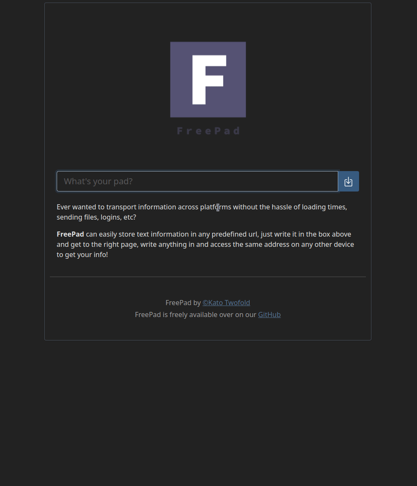

Quickly create "pads" and share with others

[](https://hub.docker.com/r/justkato/freepad)
[](https://ko-fi.com/justkato)


[](https://pad.justkato.me/)

# **FreePad**




**FreePad** is a simple `Go` project to help you juggle temporary notes that you might wanna pass from one device to another, or from a person to another with memorable and easy to communicate online "Pads".

The project is absolutely free to use, you can extend the code and even contribute, I am more than happy to be corrected in my horrible beginner code.

The current maintainer and creator is `Kato Twofold`

# 🛑 About reverse proxying 🛑
If you are looking to reverse proxy this program, please keep in mind that the websockets have specific settings regarding reverse proxying, I have tried using `Apache2` but to no luck, if someone could give a suggestion as to how to set up my own program on `Apache2` it'd be amazing.
On `Nginx` it's rather simple, here is my reverse proxy for the demo at [pad.justkato.me](https://pad.justkato.me/)
```nginx
server {
    # Define the basic information such as server name and log location
    server_name     pad.justkato.me
    access_log      logs/pad.justkato.me.access.log main;

    # setup the reverse proxy
    location / {
        proxy_pass      http://127.0.0.1:1626;
        proxy_set_header X-Real-IP $remote_addr;
        proxy_set_header Host $host;
        proxy_set_header X-Forwarded-For $proxy_add_x_forwarded_for;

        # WebSocket support !! Important !!
        proxy_http_version 1.1;
        proxy_set_header Upgrade $http_upgrade;
        proxy_set_header Connection "upgrade";
    }
}
```


Before getting started there are a couple things you should configure before proceeding, such as the database storage type and a couple limits, now if you really want to you can skip these but it's better to know what you're running as to not wake up with a not-so-nice surprise.


The `.env` file contains all of the available options and you should use it to change those said variables, these are really important to customizing and self hosting this experience for yourself.

If you need any help with any setting you can always open an issue over on github and get help from me.

If you are barely getting started with hosting your own services, or even Sys admin stuff in general or writing code my suggestion is to just copy `.env` and leave it as is until you get it running with the defaults running fine, afterwards you can play with it a little and who knows, maybe even get to learn something!


## Docker `(Recommended)`
```bash
# Get into a directory to run this
mkdir ~/freepad && cd freepad

# Copy the latest .env and docker-compose.example.yaml files
wget -O docker-compose.yaml https://raw.githubusercontent.com/JustKato/FreePad/master/docker-compose.example.yaml
wget -O .env https://raw.githubusercontent.com/JustKato/FreePad/master/.env.example

# Edit your docker-compose.yaml and change the DOMAIN_BASE environment variable
vim docker-compose.yaml

# Edit your .env file and change the variables to your liking
vim .env

# Run the container
docker-compose up
# Run the container in the background
docker-compose up -d
```
## Distribution
[Downloads here](https://github.com/JustKato/FreePad/releases)
```bash
# Get into a directory to run this
mkdir ~/freepad && cd freepad

# Get the latest distribution from https://github.com/JustKato/FreePad/releases
wget -O release.zip https://github.com/JustKato/FreePad/releases/download/main/...

# Unzip the release
unzip release.zip

# Edit the .env file
vim ./.env

# Run the program
./freepad
```

## Building
```bash
# Clone th erepo
git clone https://github.com/JustKato/FreePad.git ~/freepad

# Get into the directory
cd ~/freepad

# Build using the script
./build.sh

# Copy the environment variable
cp .env dist/

# Go into the program's directory
cd dist

# Run the program
./freepad
```